# Haven Builders Website
Welcome to Haven Builders, your trusted partner in creating dream homes. We specialise in personalised, sustainable, and high-quality home-building solutions to bring your vision to life. Explore our services and let us help you design the home you've always wanted.

Table of Contents
1. [Overview](#overview)
2. [Key Features](#key-features)
3. [Purpose](#purpose)
4. [Goal](#goal)
5. [Rationale](#rationale)
6. [User Experience (UX Design)](#user-experience-ux-design)
7. [Pages](#pages)
8. [Balsamiq-Wireframe](#balsamiq-wireframe)
9. [Technologies Used](#technologies-used)
10. [Project Setup](#project-setup)
11. [Installation](#installation)
12. [Testing](#testing)
12. [Contributing](#contributing)

## Overview

This project is a comprehensive web platform designed to streamline the process of building homes. Whether you’re a client looking to construct your dream house, an architect designing innovative structures, or a contractor managing projects, BuildEase provides the tools and features to make the process collaborative, efficient, and transparent

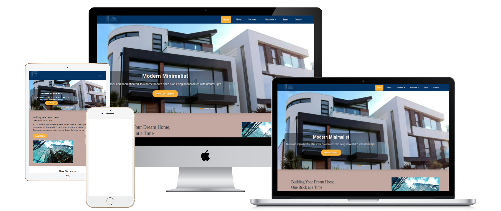

This project is a comprehensive web platform designed to streamline the process of building homes. Whether you are a client looking to construct your dream house, an architect designing innovative structures, or a contractor managing projects, Haven Builders provides the tools and features to make the process collaborative, efficient, and transparent

- Affordable and customisable home options for first-time homebuyers.
- Partnerships for large-scale housing projects for developers and investors.
- Solutions for remodelling or extending existing homes for homeowners.
- Collaboration opportunities for architects and designers to work with skilled builders.
- Sustainable and energy-efficient construction options for eco-conscious individuals.

## Purpose

The purpose of Haven Builders is to provide a seamless and efficient home-building experience tailored to the unique needs of each client. By combining innovative technology, expert craftsmanship, and personalised service.

---
## Goal
- Empower clients to realise their dream homes through customisable options.
- Facilitate transparent communication and collaboration throughout the building process.
- Promote sustainability by offering eco-friendly materials and energy-efficient designs.
- Build lasting relationships with clients, investors, and industry professionals.
- Generate Leads: Attract potential homeowners and developers to inquire about building services.
- Increase Sales: Convert website visitors into paying clients by showcasing completed projects and affordable packages.
- Brand Visibility: Establish the company as a trusted and reliable name in the home construction industry.
- Showcase Expertise: Highlight design, construction, and sustainability credentials to build trust with potential clients.
Haven Builders focuses on simplifying the home-building process, delivering high-quality services, and ensuring customer satisfaction.
---
## Rationale
This project was created to address the need for an easy-to-use platform for **home buying and renovation**. The website provides users with an intuitive interface to browse homes for sale, view renovation tips, and connect with experts in the field. 

By using **Bootstrap**, the decision was made to ensure the website is **mobile-first**, **responsive**, and **fast**. This ensures that users can seamlessly browse and interact with the platform on any device, whether they are on a desktop, tablet, or mobile phone. The goal is to provide a smooth user experience that caters to potential homebuyers and homeowners looking to renovate their properties.

#### Call to Action (CTA) Ideas
1. **Request a Free Consultation** – Encourage visitors to schedule a meeting or call.
2. "Get a Quote Today" – Direct users to fill out a form for a customized price estimate.
3. "View Our Projects" – Showcase a portfolio of completed homes to inspire and impress.
4. "Contact Us" – Provide an easy way to reach out for more details.
5. "Subscribe for Updates" – Offer newsletters or updates on new designs, promotions, and tips.
#### Users
1. First-time Homebuyers: Individuals or families looking for affordable and customized home options.
2. Developers and Investors: Professionals seeking partnerships for large-scale housing projects.
3. Homeowners: People interested in remodeling or building extensions to existing homes.
4. Architects and Designers: Those looking for a builder to collaborate with on client projects.
5. Eco-conscious Individuals: People who prioritize sustainability and energy efficiency in home construction.
#### Users’ Needs
1. Information Transparency: Clear details about costs, timelines, and materials used.
2. Customization Options: Ability to tailor the design and features of the home.
3. Reliability and Trust: Assurance of quality and timely delivery through testimonials, reviews, and certifications.
4. Ease of Access: Simple navigation to find information about designs, pricing, and services.
5. Inspiration and Guidance: Examples of completed projects, blogs, and resources to help plan their homes.
6. Support and Communication: Quick response to queries and consistent updates during the building process.
7. Sustainability Options: Eco-friendly materials and energy-efficient building method
---
## User Experience (UX Design)

Creating a user experience (UX) for the above test cases would involve detailing how users interact with the website or application, considering the usability, flow, and expectations for each feature. Here's a breakdown of the user experience for each section:

1. Navigation Bar (TC_001)
User Story:
The user lands on the homepage and uses the navigation bar to explore different sections of the website.

UX Flow:
The user opens the homepage and sees a clear and intuitive navigation bar at the top.
The navigation links (Home, About, Services, Portfolio, Team, Contact Us) are easy to identify, with hover effects to indicate interactivity.
Clicking any of the links smoothly transitions the user to the respective page, ensuring they are redirected accurately.
The visual appearance of the active page is highlighted in the navigation bar.
User Expectation:
The user expects a seamless and intuitive experience where they can easily navigate to different pages without any disruptions or confusion.

2. Carousel (TC_002)
User Story:
The user interacts with the carousel on the homepage to view different images and captions.

UX Flow:
Upon landing on the homepage, the user notices a carousel of images with captions, displaying key projects.
The carousel automatically cycles through images, and the user can manually navigate by clicking on left or right arrows.
Each image in the carousel has a caption that provides context about the project.
The user can pause and play the carousel at any time to focus on specific images.
User Expectation:
The user expects the carousel to be visually appealing, easy to navigate, and informative. They want the carousel to be functional and responsive to manual navigation as well as automatic transitions.

3. Introduction Section (TC_003)
User Story:
The user wants to learn more about the company by clicking the "Learn More" button in the introduction section.

UX Flow:
As the user scrolls down the homepage, they find the introduction section with a "Learn More" button.
The button is prominently placed and stands out with a clear call to action.
When the user clicks the button, they are smoothly redirected to the About Us page, where they can find more information about the company.
The transition to the About Us page is fast, and the user doesn’t feel interrupted.
User Expectation:
The user expects the "Learn More" button to be easily clickable and take them directly to the About Us page, providing more details about the company in a digestible format.

4. Service Cards (TC_004)
User Story:
The user wants to know more about the company's services and sees the service cards on the homepage.

UX Flow:
Upon landing on the homepage, the user sees the "Our Services" section clearly displayed, with three distinct cards for each service.
Each card has a brief description of the service (Project Management, Design & Architecture, and Design & Remodelling) with an icon or image representing each service.
The user can click on any service card to view more detailed information about that service on the service page.
The cards are interactive, with hover effects that make them visually engaging.
User Expectation:
The user expects the service cards to be easy to understand and to quickly find out more about the services offered by the company. The cards should provide a brief summary and allow further exploration.

5. Get a Quote (TC_005)
User Story:
The user wants to request a quote by clicking on the "Get a Quote" button.

UX Flow:
The user sees a "Get a Quote" button clearly placed on the homepage.
Upon clicking the button, the user is redirected to a page with completed projects, providing an overview of what they could expect in terms of services and prices.
The button redirects smoothly, and the user can explore the portfolio before deciding to request a quote.
User Expectation:
The user expects the "Get a Quote" button to be easy to find and functional, redirecting them to the appropriate page where they can explore project details before making a decision.

6. Footer Links (TC_006)
User Story:
The user wants to access important pages like Home, About Us, Services, Portfolio, Team, and Contact Us through footer links.

UX Flow:
When the user scrolls down to the bottom of the page, they see the footer links clearly displayed.
These links are easy to locate and clickable, taking the user to the corresponding pages.
There’s no need to scroll back to the top to access other sections, making the footer links very useful for quick navigation.
User Expectation:
The user expects all footer links to work seamlessly, taking them to the correct pages. The footer should provide easy access to essential sections of the site without confusion.

7. Contact the Company (TC_015)
User Story:
The user wants to contact the company and find the "Contact Us" link in the header and footer.

UX Flow:
The user finds the "Contact Us" link both in the header and footer of the page.
Clicking the link opens a form with fields for name, email, message, phone number, and other relevant contact details.
The user can easily submit the form, and a confirmation message appears after submission.
User Expectation:
The user expects that the "Contact Us" link is easy to find and works without issue. The contact form should be intuitive and quick to fill out, with clear instructions and a confirmation message once submitted.

8. Subscribe for Updates (TC_018)
User Story:
The user wants to subscribe to updates using the subscription form on the homepage.

UX Flow:
The user sees the subscription form prominently displayed on the homepage or in the footer.
They enter their email address and click the subscribe button.
A confirmation message appears after submitting the form, and the user is also sent a welcome email.
The form is straightforward and requires minimal information, ensuring a smooth experience for the user.
User Expectation:
The user expects the subscription process to be simple and fast. The form should be clear, with minimal distractions, and the confirmation should be immediate, both on-screen and through email.

### User Stories

**User Story 1**: Navigation Menu
As a user,
I want to easily navigate through the website using a menu bar,
So that I can quickly access pages like Home, About, Services, Portfolio, Team, and Contact Us.

Acceptance Criteria:
A menu bar is displayed on the homepage with links to Home, About, Services, Portfolio, Team, and Contact Us.
The menu bar is responsive and accessible on all devices.
Clicking any of the menu items takes the user to the corresponding page.

**User Story 2**: Request a Free Consultation
As a potential homebuyer, I want to request a free consultation,So that I can discuss my home-building requirements with a professional.
Acceptance Criteria:
1. A **Request a Free Consultation** button is displayed prominently on the homepage.
2. Clicking the button opens a form with fields for name, contact information, and project details.
3. After submitting the form, a confirmation message is displayed.
4. The user receives an email confirming their consultation request and outlining next steps.

**User Story 3**: Carousel Display of Completed Projects
As a user,
I want to see a carousel showcasing completed projects,
So that I can get an overview of the company’s work and quality.

Acceptance Criteria:
A carousel is displayed on the homepage showing completed projects.
Each project in the carousel has a caption describing the project.
The carousel moves automatically but can be manually controlled by the user.

**User Story 3**: View Completed Projects
As a website visitor,I want to browse a portfolio of completed projects, So that I can see examples of the company’s work and assess quality.
Acceptance Criteria:
1. A **View Our Projects** section is available on the homepage and in the navigation menu.
2. The portfolio includes high-quality images, project descriptions, and client testimonials.
3. Users can filter projects by type (e.g., single-family homes, eco-friendly builds, luxury homes).
4. Clicking on a project opens a detailed view with additional photos and specifications.

**User Story 4**: Introduction Section with "Learn More" Button
As a user,
I want to read an introduction about the company on the homepage,
So that I can learn more about the company’s values and what they offer.

Acceptance Criteria:
An introduction section is displayed on the homepage, containing text that introduces the company.
A "Learn More" button is displayed in this section.
Clicking the "Learn More" button redirects the user to the About Us page.
The section includes an image representing the company or its work.

**User Story 3**: Get a Quote
As a prospective client, I want to request a personalized quote,So that I can understand the cost of building my home.
Acceptance Criteria:
1. A **Get a Quote** button is accessible on the homepage.
2. Clicking the button opens a form with fields for project type, location, size, and budget.
3. Users must fill in all required fields to submit the form.
4. Upon submission, users see a confirmation message and receive an email summarising their request.

**User Story 4:** Explore Sustainable Options
As an eco-conscious buyer,I want to explore sustainable building materials and practices,So that I can build an environmentally friendly home.
Acceptance Criteria:
1. A **Sustainability** section is included in the main navigation menu.
2. The section provides information on eco-friendly materials, energy-efficient designs, and certifications.
3. Users can view examples of sustainable homes built by the company.
4. A CTA prompts users to contact the company for eco-friendly building consultations.

**User Story 5**: Contact the Company
As a user,I want an easy way to contact the company,So that I can get my questions answered quickly.
Acceptance Criteria:
1. A **Contact Us** link is visible in the website header, footer, and main navigation menu.
2. The contact page includes a form, phone number, email address, and business hours.
3. Users can fill out the form with their name, email, and message.
4. A confirmation message is displayed after submitting the form, and users receive an acknowledgment email.

**User Story 6:** Subscribe for Updates
As a visitor,I want to subscribe to the company’s newsletter,So that I can receive updates about new projects, promotions, and home-building tips.
Acceptance Criteria:
1. A subscription form is available on the homepage and footer of the website.
2. The form requires an email address to subscribe.
3. Users see a confirmation message after subscribing.
4. Subscribers receive a welcome email with information about the company and a link to unsubscribe if needed.

**User Story 7**: Access Testimonials and Reviews
As a potential client,I want to read testimonials and reviews from previous customers,So that I can feel confident about choosing the company.

Acceptance Criteria:
1. A **Testimonials** section is prominently displayed on the homepage and has its dedicated page.
2. Testimonials include customer photos, names, and feedback about the building process and results.
3. A star rating or review widget is displayed to reflect customer satisfaction.
4. Users can filter reviews by project type (e.g., family homes, eco-friendly designs).

---

## Pages 

1. Desktop Version (Screens 1025px and above)
"You're viewing the desktop version."
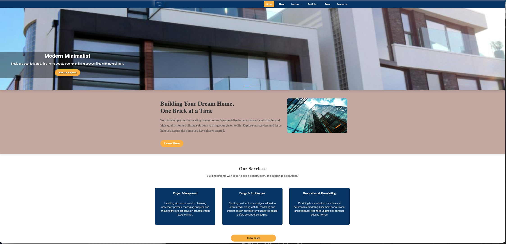
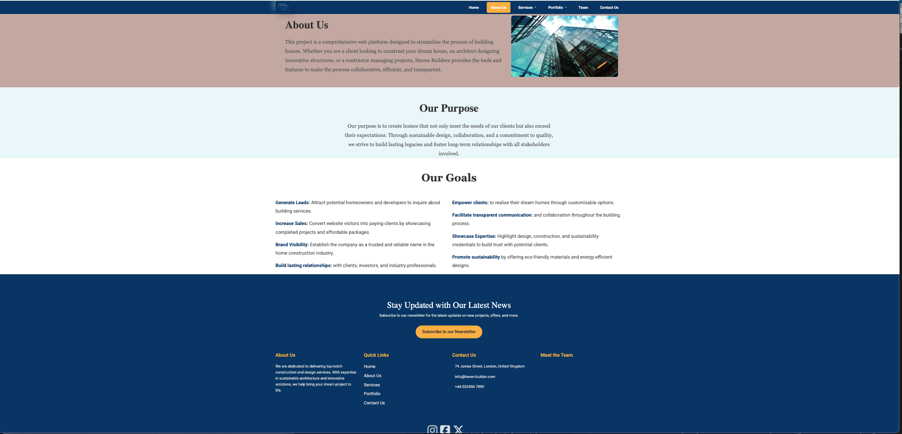
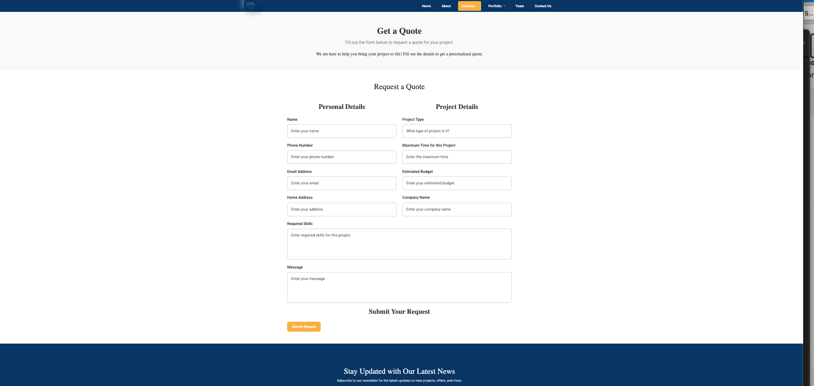
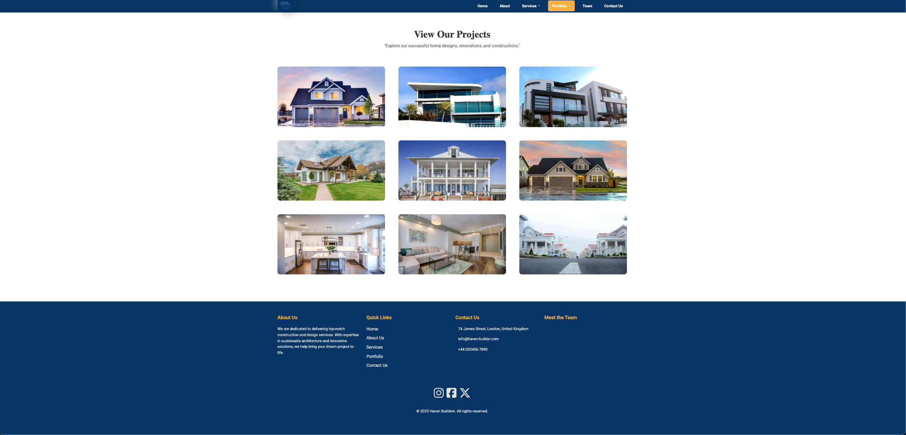
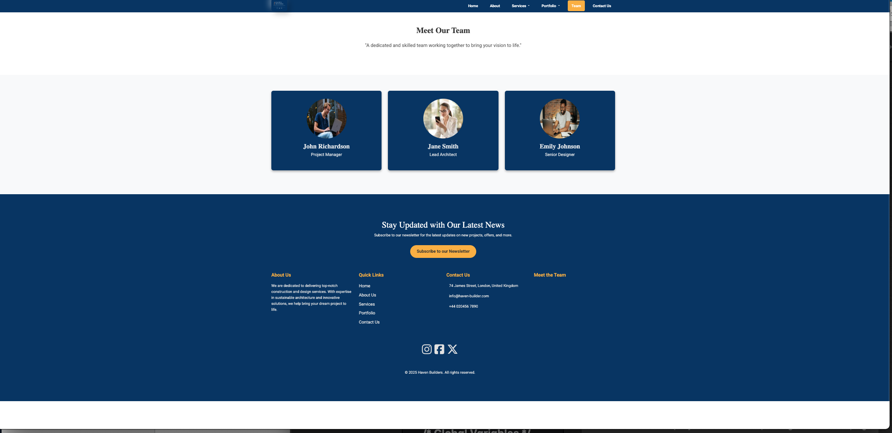
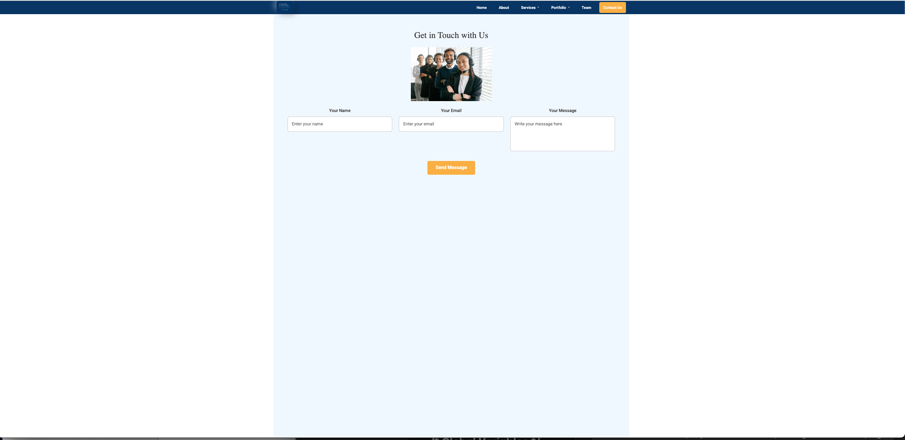

2. Tablet Version (Screens between 768px and 1024px)
"You're viewing the tablet version."
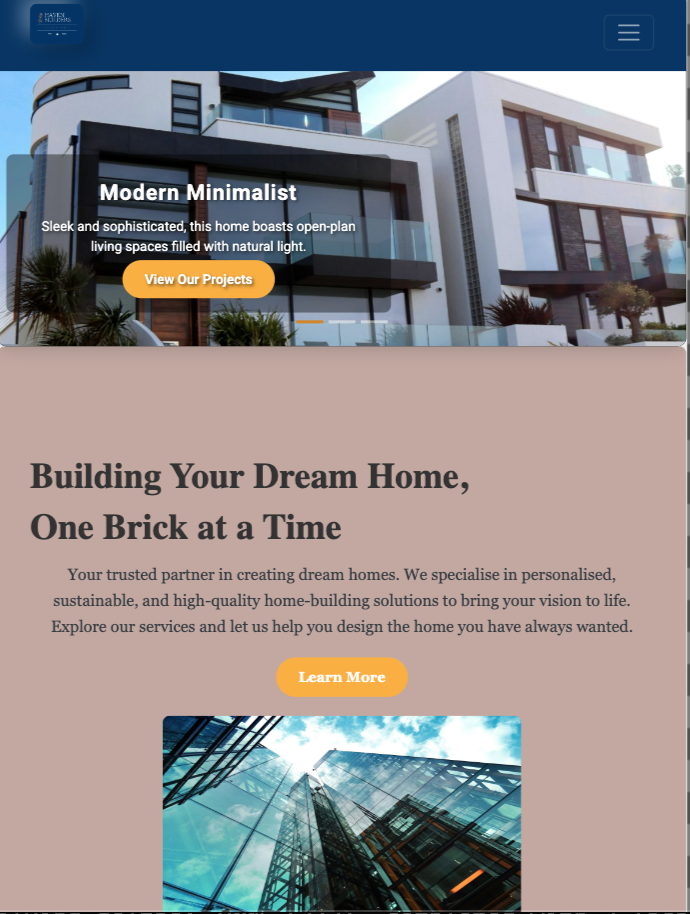
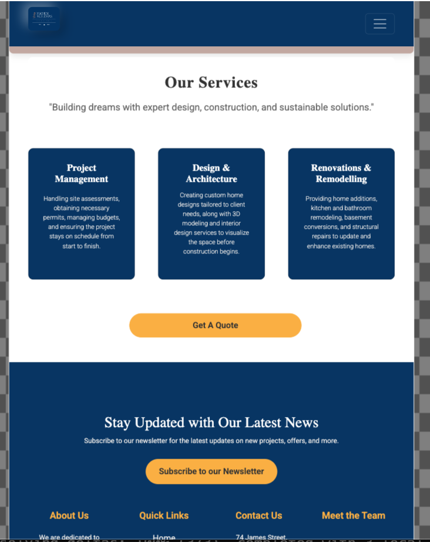

3. Mobile Version (Screens 767px and below)
"You're viewing the mobile version."
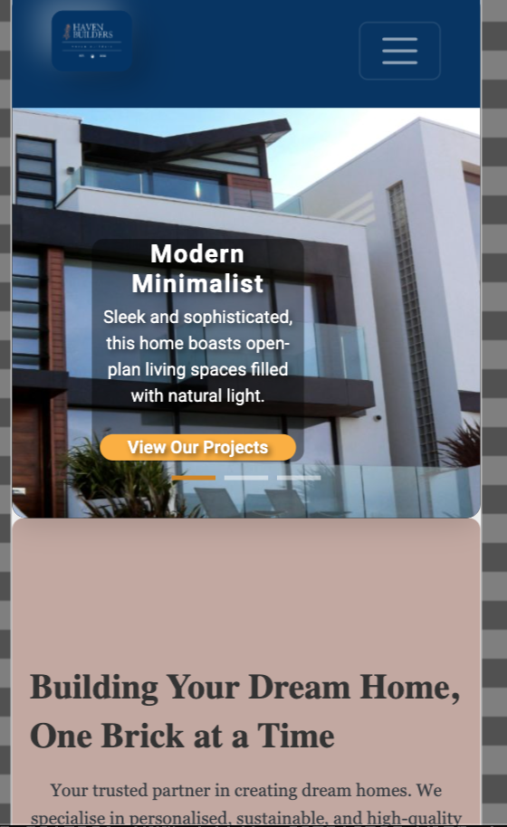
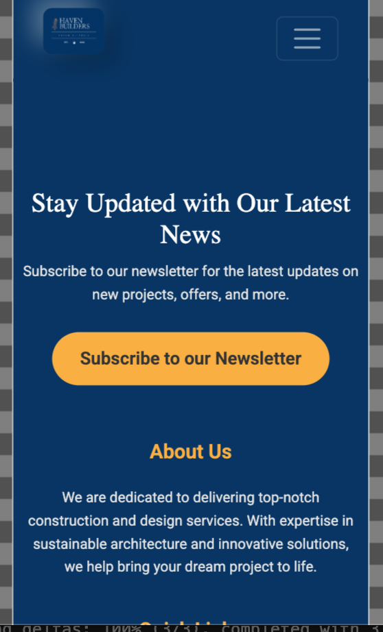

### Balsamiq Wireframe
You can view the Balsamiq wireframe 
[Home](documentation/Haven-Builder-Desktop/Home.png).
[About Us](documentation/Haven-Builder-Desktop/About.png).
[Services](documentation/Haven-Builder-Desktop/Services.png).
[Portfolio](documentation/Haven-Builder-Desktop/Portfolio.png).
[Team](documentation/Haven-Builder-Desktop/Team.png).
[Contact Us](documentation/Haven-Builder-Desktop/Contact%20Us.png).

---
## Technologies Used

- **HTML:**
A markup language that structures content on a webpage using elements like headings, paragraphs, images, and links.

- **CSS:**
A styling language used to define the appearance of HTML elements, including layout, colors, fonts, and responsiveness.

- **Bootstrap:**
A front-end framework that provides pre-built components and a responsive grid system for faster web design.

- **[Other Technologies]** - Git & GitHub:
Git: A version control system that tracks code changes and allows collaboration.
GitHub: A platform that hosts Git repositories, enabling collaboration and version tracking on projects.

## Project Setup

Follow these steps to set up and get started with the project.

### Prerequisites
Before you begin, make sure you have the following installed on your local machine:

- **Git**: To clone the repository.
- **A web browser**: To view the project after setting it up locally.

### Cloning the Repository
Start by cloning the repository to your local machine using Git:

---
## Testing

| **Tests**                           | **Test Case ID**   | **Test Scenario**           | **Test Steps**                                                                                      | **Expected Result**                                                   | **Pass/Fail Criteria**                                                             |
| ----------------------------------- | ------------------ | --------------------------- | -------------------------------------------------------------------------------------------------- | -------------------------------------------------------------------- | ---------------------------------------------------------------------------------- |
| **Navigation Bar**                  | TC_001             | Test navigation bar links on the homepage | 1. Open the homepage.   2. Click on "Home" link.   3. Click on "About" link.   4. Click on "Services" link.   5. Click on "Portfolio" link.   6. Click on "Team" link.   7. Click on "Contact Us" link. | Each link should redirect the user to the corresponding page. | All links are working correctly and redirect to the expected page. |
| **Carousel**                        | TC_002             | Test carousel functionality on the homepage | 1. Open the homepage.   2. Verify that the carousel is present.   3. Check if the carousel automatically moves.   4. Click on the left/right arrows to manually navigate through the carousel. | The carousel should display completed projects with captions. It should auto-rotate and be manually navigable. | Carousel moves automatically, can be manually controlled, and displays correct information. |
| **Introduction Section**            | TC_003             | Test functionality of the "Learn More" button in the introduction section | 1. Open the homepage.   2. Locate the "Learn More" button.   3. Click on the "Learn More" button. | The user should be redirected to the **About Us** page. | The button should redirect to the **About Us** page correctly. |
| **Service Cards**                   | TC_004             | Test the visibility and information of the service cards on the homepage | 1. Open the homepage.   2. Verify that the "Our Services" section is displayed.   3. Check if there are three cards for each service.   4. Verify the text on each card. | The service cards should display the text for each service correctly (Project Management, Design & Architecture, and Design & Remodelling). | The cards are displayed correctly with accurate service descriptions. |
| **Get a Quote**                     | TC_005             | Test the "Get a Quote" button functionality | 1. Open the homepage.   2. Locate the "Get a Quote" button.   3. Click on the "Get a Quote" button. | The user should be redirected to the **Portfolio** page displaying completed projects. | Clicking the button redirects to the **Portfolio** page. |
| **Footer Links**                    | TC_006             | Test footer links functionality | 1. Scroll to the bottom of any page.   2. Verify that quick links are present in the footer.   3. Click on each link in the footer. | All footer links should redirect to the corresponding pages (Home, About Us, Services, Portfolio, Meet the Team, Contact Us). | All links in the footer should work correctly and redirect to the appropriate pages. |
| **Footer Links**                    | TC_007             | Test "Meet the Team" link in the footer | 1. Scroll to the bottom of any page.   2. Click on the "Meet the Team" link in the footer. | The "Meet the Team" link should redirect to the **Team** page. | The link should redirect to the correct page (**Team** page). |
| **View Completed Projects**         | TC_008             | Section Visibility           | 1. Open the homepage. 2. Verify that the "View Our Projects" section is visible.                 | The "View Our Projects" section is visible on the homepage.         | **Pass:** Section is visible.                  |
| **View Completed Projects**         | TC_009             | Portfolio Navigation         | 1. Navigate to the "View Our Projects" section. 2. Check for project categories (e.g., homes, eco-friendly). | Users can filter projects by type (single-family, eco-friendly, etc.). | **Fail:** Filters do not work. (Filters is not yet implemented on the page) |
| **View Completed Projects**         | TC_010             | Project Detail View          | 1. Click on a project image. 2. Verify if additional project details and images are displayed.    | A detailed view with more photos and project specifications appears. | **Pass:** Detailed view is displayed.    |
| **Get a Quote**                     | TC_011             | Button Visibility            | 1. Open the homepage. 2. Verify the "Get a Quote" button is visible.                              | The "Get a Quote" button is visible and clickable.                  | **Pass:** Button is visible. **Fail:** Button is not visible.                    |
| **Get a Quote**                     | TC_012             | Form Display                 | 1. Click the "Get a Quote" button. 2. Verify the quote request form appears.                      | The form with fields for project type, location, size, and budget appears. | **Pass:** Form is displayed with required fields. **Fail:** Form does not display or missing fields. |
| **Get a Quote**                     | TC_013             | Form Submission              | 1. Fill out the form with valid details. 2. Click the submit button.                              | A confirmation message appears after submitting the form.           | **Pass:** Confirmation message is shown.      |
| **Get a Quote**                     | TC_014             | Email Confirmation           | 1. Submit the quote request form. 2. Verify if an email is received with the summary of the request. | User should receive an email with a summary of their quote request.       | **Fail:** No email received. (No email integration on the web page yet)            |
| **Contact the Company**             | TC_015             | Link Visibility              | 1. Open the homepage. 2. Verify that the "Contact Us" link is visible in the header and footer.   | The "Contact Us" link is visible in the header and footer.         | **Pass:** Link is visible. **Fail:** Link is not visible.                        |
| **Contact the Company**             | TC_016             | Form Display                 | 1. Click the "Contact Us" link. 2. Verify the contact form, phone number, email, and business hours are displayed. | A contact form, phone number, email, and business hours are displayed. | **Pass:** All elements are visible. **Fail:** Missing elements.                  |
| **Contact the Company**             | TC_017             | Form Submission              | 1. Fill out the contact form with valid details. 2. Click the submit button.                      | A confirmation message is displayed after submitting the form.      | **Pass:** Confirmation message is shown.      |
| **Subscribe for Updates**           | TC_018             | Subscription Form Visibility  | 1. Open the homepage. 2. Verify that the subscription form is available on each of the pages (Home, About Us, Services, Portfolio, Team, Contact Us).                          | The subscription form is visible on the homepage and footer.       | **Pass:** Form is visible.                        |
| **Subscribe for Updates**           | TC_019             | Form Submission              | 1. Enter client details (Name, Email, Message) in the subscription form. 2. Click the subscribe button.                 | A confirmation message appears after submitting the form.          | **Pass:** Confirmation message is shown.      |
| **Subscribe for Updates**           | TC_020             | Email Confirmation           | 1. Subscribe with a valid email address. 2. Verify if a welcome email is received.                | User should receive an welcome email with information about the company.   |  **Fail:** No welcome email. (Fail at the moment, there is no email integratio functionality yet)     |
